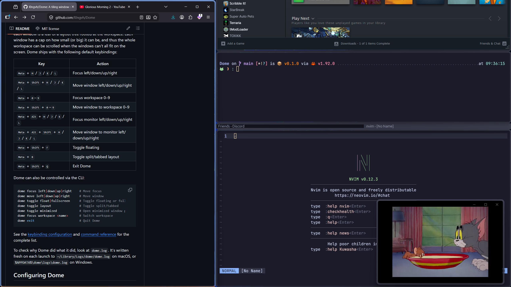

# Dome

**Dome** is a tiling window manager that works on Windows and macOS.



## Install

**Windows (Scoop)**
```bash
scoop bucket add dome https://github.com/l0ngvh/scoop-dome
scoop install dome-nightly
```

**macOS (Homebrew)**
```bash
brew install --cask l0ngvh/homebrew-dome/dome-nightly
```

Or build from source with a [Rust toolchain](https://rustup.rs/):

```bash
git clone https://github.com/l0ngvh/Dome
cd Dome
cargo install --path .
dome
```

On macOS, Dome needs Accessibility permissions to manage windows, and Screen
Capture permissions to render float windows. macOS will prompt you for both on
first launch. No extra permissions are required on Windows.

## Using Dome

By default, Dome uses a modified version of the i3 layout, where each window is
a leaf of a layout tree rooted at the workspace. Each window has a cap on how
small (or big) it can be, and thus the whole workspace can be scrolled when the
windows can't all fit on the screen.

Dome ships with the following default keybindings:

| Key | Action |
|-----|--------|
| <kbd>Alt</kbd> + <kbd>H</kbd> / <kbd>J</kbd> / <kbd>K</kbd> / <kbd>L</kbd> | Focus left/down/up/right |
| <kbd>Alt</kbd> + <kbd>Shift</kbd> + <kbd>H</kbd> / <kbd>J</kbd> / <kbd>K</kbd> / <kbd>L</kbd> | Move window left/down/up/right |
| <kbd>Alt</kbd> + <kbd>0</kbd>-<kbd>9</kbd> | Focus workspace 0-9 |
| <kbd>Alt</kbd> + <kbd>Shift</kbd> + <kbd>0</kbd>-<kbd>9</kbd> | Move window to workspace 0-9 |
| <kbd>Alt</kbd> + <kbd>Ctrl</kbd> + <kbd>H</kbd> / <kbd>J</kbd> / <kbd>K</kbd> / <kbd>L</kbd> | Focus monitor left/down/up/right |
| <kbd>Alt</kbd> + <kbd>Ctrl</kbd> + <kbd>Shift</kbd> + <kbd>H</kbd> / <kbd>J</kbd> / <kbd>K</kbd> / <kbd>L</kbd> | Move window to monitor left/down/up/right |
| <kbd>Alt</kbd> + <kbd>Shift</kbd> + <kbd>F</kbd> | Toggle floating |
| <kbd>Alt</kbd> + <kbd>B</kbd> | Toggle split/tabbed layout |
| <kbd>Alt</kbd> + <kbd>Shift</kbd> + <kbd>Q</kbd> | Close focused window |

## Configuring Dome

Dome is configured by editing `config.lua`, created on first launch. The
default locations are:

- macOS: `~/.config/dome/config.lua` (or under `$XDG_CONFIG_HOME/dome/`).
- Windows: `%APPDATA%\dome\config.lua`.

```lua
local config = dome.defaults()

config.theme = "latte"
config.font_size = 15.0

-- Add a key binding to the default list
config.keymaps.main[Meta + "space"] = function(actions)
  actions.execute("open -a Raycast")
end

-- Different configuration based on platform.
local terminal = dome.os == "macos" and "open -a Terminal" or "wt"
config.keymaps.main[Meta + "return"] = function(actions)
  actions.execute(terminal)
end

-- Ignore, float, or fullscreen windows that match a rule.
-- All keys must match, and the first matching rule wins.
config.ignore = { { app = "Finder", title = "Trash" } }
config.float = { { app = "System Settings" } }
config.fullscreen = { { app = "/IINA|VLC/" } }  -- wrap a value in /.../ for a regex match

return config
```

## Defining key bindings

```lua
local config = dome.defaults()

config.keymaps.main["h"] = function(actions) actions.focus.left() end
-- Dome provides helpers for the modifiers, including `Meta`/`Cmd`/`Win`, `Alt`/`Opt`, `Ctrl` and `Shift`
config.keymaps.main[Meta + "h"] = function(actions) actions.focus.left() end
-- trigger multiple actions
config.keymaps.main[Meta + Shift + "1"] = function(actions)
  actions.move.workspace("1")
  actions.focus.workspace("1")
end
local hyper = Meta + Alt + Shift + Ctrl
config.keymaps.main[hyper + "space"] = function(actions)
  actions.execute("open -a Terminal")
end
-- Raw string also works
config.keymaps.main["meta+return"] = function(actions) actions.execute("open -a Terminal") end
```

To add another keymap table:

```lua
config.keymaps.main[Meta + "m"] = function(actions) actions.mode("monitor") end
config.keymaps.monitor = {
  ["h"] = function(actions) actions.focus.monitor("left") end,
  ["l"] = function(actions) actions.focus.monitor("right") end,
  -- keep a binding back to main, or the keyboard stays in this keymap until Dome restarts
  ["escape"] = function(actions) actions.mode("main") end,
}
```

If you don't need the defaults, you can override the default table like this:

```lua
config.keymaps = {
  main = {
    [Meta + "h"] = function(actions) actions.focus.left() end,
    [Meta + "r"] = function(actions) actions.mode("resize") end,
  },
  resize = {
    ["h"] = function(actions) actions.master.shrink() end,
    ["l"] = function(actions) actions.master.grow() end,
    ["escape"] = function(actions) actions.mode("main") end,
  },
}
```

To change the base modifier from the default `Alt`:

```lua
local config = dome.with_default_modifier(Meta).defaults()
return config
```

## Controlling Dome from the CLI

Dome can also be controlled via the CLI:

```bash
dome focus left|down|up|right    # Move focus
dome move left|down|up|right     # Move window
dome toggle float|fullscreen     # Toggle floating or fullscreen
dome toggle layout               # Toggle split/tabbed
dome focus workspace <name>      # Switch workspace
dome close                       # Close focused window
dome exit                        # Quit Dome
```

See the [keybinding configuration](docs/configuration.md#keymaps) and
[CLI reference](docs/cli.md) for the complete list.

## Preferred layout

Dome can remember how a workspace is arranged and restore it the next time those
windows open. Once a workspace looks right, save its arrangement:

```bash
dome export
```

That writes the arrangement to `layout.lua`, next to your `config.lua`:

```lua
---@type dome.Layout
return {
  workspace = {
    {
      name = "3",
      strategy = "master",
      float = { { process = "calc.exe" } },
      fullscreen = { { title = "/Media Player/" } },
      master = { { process = "code.exe" } },
      secondary = {
        { process = "terminal.exe", title = "build" },
        { process = "terminal.exe", title = "test" },
      },
    },
  },
}
```

Edit the file by hand to refine it, for example to match a window with a
regular expression.

See [Layout](docs/layout.md#preferred-layout) for more detail.

## Documentation

- [Configuration](docs/configuration.md)
- [Layout](docs/layout.md)
- [Integration](docs/integration.md)
- [CLI](docs/cli.md)
- [FAQ](docs/faq.md)

## Background

Before Dome, there were already plenty of excellent window managers for macOS
and Windows. The problem is, I'd like to enjoy gaming with friends on Windows,
while still having to ship code handed to me by my manager on macOS, and
maintaining two sets of configuration and getting them to behave consistently
takes a lot of work. So I just decided to put in even more work and build Dome.

## Credits

Dome draws a lot of inspiration from these awesome WMs and likely wouldn't
exist without them:
- [AeroSpace](https://github.com/nikitabobko/AeroSpace)
- [GlazeWM](https://github.com/glzr-io/glazewm)
- [komorebi](https://github.com/LGUG2Z/komorebi)
- [Sway](https://github.com/swaywm/sway)
- [niri](https://github.com/niri-wm/niri)

## License

Dome is released under the [MIT License](LICENSE).
